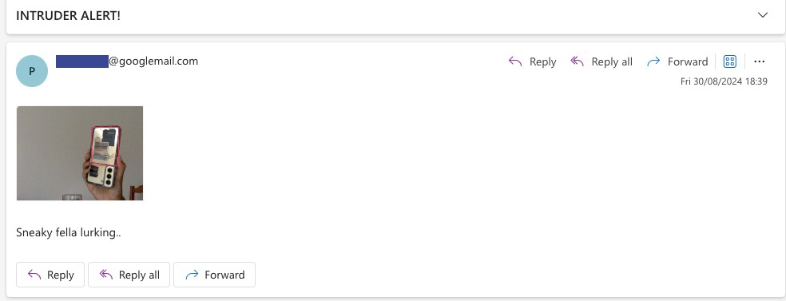

# Webcam monitoring email alert

### Goals:
- Capture webcam video
- Detect moving objects
- Extract images of moving objects
- Send email with attached image of object

### Techniques/Libraries used: 
- Threading
- glob
- cv2
- streamlit 
- datetime

### Preview
